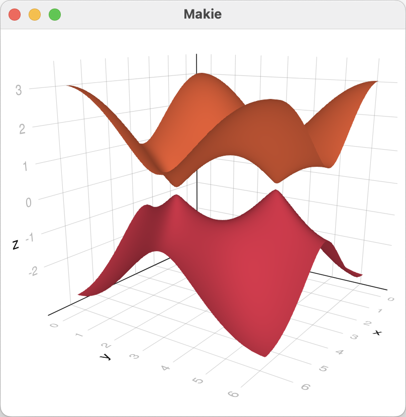

<!-- [](https://pablosanjose.github.io/Quantica.jl/stable) -->
[](https://pablosanjose.github.io/Quantica.jl/dev)
[](https://doi.org/10.5281/zenodo.4762964)
[](https://github.com/pablosanjose/Quantica.jl/actions)
[](https://codecov.io/gh/pablosanjose/Quantica.jl)
[](https://github.com/pablosanjose/Quantica.jl)

The Quantica.jl package provides an expressive API to build arbitrary quantum systems on a discrete lattice, and a collection of algorithms to compute some of their properties.

Quantica.jl requires Julia v1.9 or later.

# Some current features

- Build and visualize Hamiltonians on discrete lattices of arbitrary dimensions, using tight-binding models with arbitrary number of orbitals
- Compute and visualize band structures of periodic systems
- Couple arbitrary Hamiltonians and compute non-interacting Green functions
- Compute transport and spectral observables, such as local density of states, current densities, conductance and Josephson currents

Some of this functionality, particularly visualization, requires loading some plot backend from the Makie repository, such as GLMakie (GPU-accelerated interactive visualization), CairoMakie (for pdf/svg output) or WGLMakie (Web-GL backend for use inside browsers)

# Example

A step-by-step construction and visualization of a Kane-Mele model (parametrized by spin orbit strength α)and of its bandstructure, encoding the pseudospin orientation in the color of the subbands.

```julia
julia> using Quantica, GLMakie

julia> SOC(dr) = ifelse(iseven(round(Int, atan(dr[2], dr[1])/(pi/3))), im, -im); # Kane-Mele spin-orbit coupling

julia> model = hopping(1, range = 1/√3) + @hopping((r, dr; α = 0) -> α * SOC(dr); sublats = :A => :A, range = 1) - @hopping((r, dr; α = 0) -> α * SOC(dr); sublats = :B => :B, range = 1);

julia> h = LatticePresets.honeycomb(a0 = 1) |> hamiltonian(model)
ParametricHamiltonian{Float64,2,2}: Parametric Hamiltonian on a 2D Lattice in 2D space
  Bloch harmonics  : 7
  Harmonic size    : 2 × 2
  Orbitals         : [1, 1]
  Element type     : scalar (ComplexF64)
  Onsites          : 0
  Hoppings         : 18
  Coordination     : 9.0
  Parameters       : [:α]

julia> qplot(h(α = 0.02), inspector = true)

julia> b = bands(h(α = 0.05), range(0, 2pi, length=60), range(0, 2pi, length = 60))
Bandstructure{Float64,3,2}: 3D Bandstructure over a 2-dimensional parameter space of type Float64
  Subbands  : 2
  Vertices  : 7200
  Edges     : 21122
  Simplices : 13924

julia> qplot(b, color = (psi, e, k) -> angle(psi[1] / psi[2]), colormap = :cyclic_mrybm_35_75_c68_n256, hide = :wireframe)
```

<p float="left">
    
    
</p>
