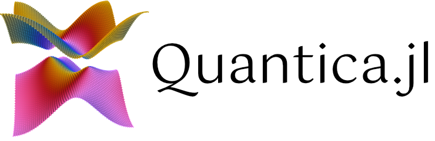

[Quantica.jl](https://github.com/pablosanjose/Quantica.jl/) is a Julia package for building generic tight-binding models and computing spectral and transport properties.

```@contents
Pages = [
    "manual.md",
    "examples.md",
    "api.md",
]
Depth = 1
```

## Installation

```julia
julia> import Pkg; Pkg.add("Quantica")
```

Quantica.jl requires Julia v1.9 or later. Some of its functionality, notably plotting, will become available only after `using GLMakie`, or some other plotting package from the [Makie.jl](https://docs.makie.org/stable/) family. Install `GLMakie` with
```julia
julia> import Pkg; Pkg.add("GLMakie")
```

Then, to begin using Quantica, just load it by doing
```julia
julia> using Quantica
```
(and possibly also e.g. `using GLMakie` if you need to plot Quantica objects).

## Asking questions, reporting bugs

If you encounter problems, please read the manual and examples, your question is probably answered there. You can also check the docstring of each Quantica function [here](@ref api) or within the Julia REPL, by entering the function preceded by a `?`, e.g. `?hamiltonian`.

If you are still stuck, you may sometimes find me (`@pablosanjose`) at the [Julia Slack](https://julialang.slack.com) or [Julia Discourse](https://discourse.julialang.org).

If you believe you found a bug in Quantica.jl, please don't hesitate to file a [GitHub issue](https://github.com/pablosanjose/Quantica.jl/issues), preferably with detailed instructions to reproduce it. Pull requests with fixes are also welcome!
